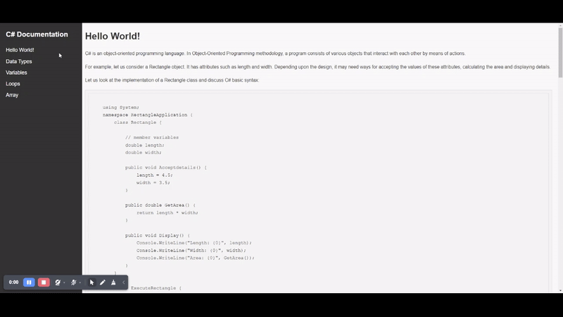

# Technical Documentation Page

The Technical Documentation Page project is an exemplary demonstration of proficiency in HTML and CSS, showcasing the ability to create clear, concise, and well-structured technical documentation.


## Technology Used ⚡

**Programming Language:** HTML5, CSS3

**Tools:** Visual Studio Code


## Installation 🔌

Clone my repository

```bash
 git https://github.com/ahmadaimandev/Documentation-Page.git
```
    
## Guidance 📚

 - [W3School](https://www.w3schools.com/)
 - [ChatGPT](https://chat.openai.com/)
 

## Screenshots 🖼




## License📃

This project is licensed under the MIT License. See the LICENSE file for more details.


## Contributing

Contributions are welcome! Feel free to submit a pull request or open an issue to discuss any changes.

